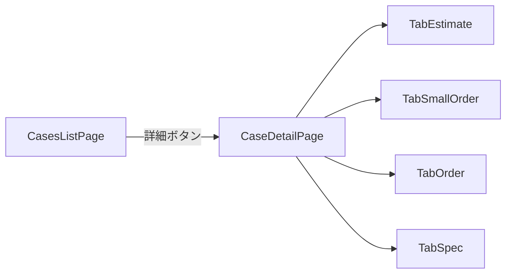

# 案件ベース再設計プラン

## 1. 差分監査（plan/DB/UIの突合）
- まず要件を基準化し、画面・API・DBの欠落を一覧化する。
- 突合元:
  - [plan.md](plan.md)
  - [web/db/migrations/002_production_schema.sql](web/db/migrations/002_production_schema.sql)
  - [web/db/migrations/003_seed_production_basics.sql](web/db/migrations/003_seed_production_basics.sql)
  - [web/app](web/app)
- 監査観点:
  - 顧客系フォーム項目（郵便番号/都道府県/市区町村/住所/電話/メール）
  - 一覧→詳細導線（一覧に詳細ボタン、詳細は別画面）
  - 新規作成導線（`/new`専用画面）
  - 検索要件（日付条件・項目選択・AND/OR）

## 2. 画面構造を案件中心に再構成
- トップは案件一覧のみとし、各行に`詳細`ボタンを配置。
- 詳細は別URLに分離: `cases/[caseId]`。
- 詳細ページ上部に案件基本情報、下部に左から4タブを配置:
  - 見積
  - 小口受注
  - 受注
  - 受注表（今回は「抜き型受注表 + LC系受注表」）
- 主要変更ファイル:
  - [web/app/cases/page.tsx](web/app/cases/page.tsx)
  - [web/app/cases/[caseId]/page.tsx](web/app/cases/[caseId]/page.tsx)（新規）
  - [web/app/_components/app-shell.tsx](web/app/_components/app-shell.tsx)
  - [web/app/globals.css](web/app/globals.css)

## 3. 新規作成導線を`/new`に統一
- 一覧には入力フォームを置かず、`新規作成`ボタンのみ配置。
- 各メニューに専用作成ページを追加:
  - `.../new`（例: `customers/new`, `delivery-destinations/new`, `estimates/new`）
- 保存後は対象一覧へ戻し、作成結果を再表示。
- 変更対象:
  - 既存一覧ページ群（`web/app/*/page.tsx`）
  - 新規作成ページ群（`web/app/*/new/page.tsx`）

## 4. 顧客/納品先フォームをDB項目に合わせて完全化
- 顧客系・納品先系フォームを`plan.md`準拠に拡張（郵便番号・都道府県など）。
- 入力値は既存APIの対応項目へマップ（不足があればAPI拡張）。
- 変更対象:
  - [web/app/customers/page.tsx](web/app/customers/page.tsx)
  - [web/app/delivery-destinations/page.tsx](web/app/delivery-destinations/page.tsx)
  - [web/app/api/customer-branches/route.ts](web/app/api/customer-branches/route.ts)
  - [web/app/api/delivery-destinations/route.ts](web/app/api/delivery-destinations/route.ts)

## 5. 検索要件の実装
- 一覧画面ごとに検索バーを追加。
- 日付検索: 対象日付項目選択 + 期間From/To。
- 文字検索: 項目選択 + キーワード + AND/OR条件。
- 初期対象: 案件/見積/受注/小口受注（利用頻度優先）。
- 方式:
  - URLクエリ同期（再読込・共有可能）
  - APIに検索パラメータ追加

## 6. 受注表タブ（抜き型/LC）の案件連動表示
- `caseId`配下の受注に紐づく抜き型/LC情報をタブ内で一覧→詳細化。
- 明細作成は`/new`へ遷移、詳細は別画面。
- 変更対象:
  - [web/app/specs/page.tsx](web/app/specs/page.tsx)（案件詳細内タブコンポーネントへ再配置）
  - [web/app/api/diecut-specs/route.ts](web/app/api/diecut-specs/route.ts)
  - [web/app/api/lc-specs/route.ts](web/app/api/lc-specs/route.ts)

## 7. 実装管理ルール運用を固定化
- 実装時は必ず進捗MDを更新（実装済み/未実装/実装予定）。
- 更新対象:
  - [IMPLEMENTATION_STATUS.md](IMPLEMENTATION_STATUS.md)
  - [\.cursor/rules/implementation-status-log.mdc](.cursor/rules/implementation-status-log.mdc)
- 受け入れ条件:
  - 変更PR内で上記2ファイルが必ず更新されていること。

## 8. 受け入れテスト
- 画面フロー:
  - 一覧→詳細ボタン→詳細画面→戻る
  - 一覧→新規作成→保存→一覧反映
- 機能:
  - 顧客系必須項目入力
  - 日付/文字検索
  - タブ遷移（見積/小口受注/受注/受注表）
- 品質:
  - `npm run lint` と `npm run build` の成功
